# Massachusetts Enrollment Trends

``` r
library(maschooldata)
library(ggplot2)
library(dplyr)
library(scales)
```

``` r
theme_readme <- function() {
  theme_minimal(base_size = 14) +
    theme(
      plot.title = element_text(face = "bold", size = 16),
      plot.subtitle = element_text(color = "gray40"),
      panel.grid.minor = element_blank(),
      legend.position = "bottom"
    )
}

colors <- c("total" = "#2C3E50", "white" = "#3498DB", "black" = "#E74C3C",
            "hispanic" = "#F39C12", "asian" = "#9B59B6")
```

``` r
# Fetch data
enr <- fetch_enr_multi(2016:2024, use_cache = TRUE)
enr_current <- fetch_enr(2024, use_cache = TRUE)
```

## 1. Boston Public Schools in decline

Boston has seen steady enrollment decline over the past decade, losing
over 10,000 students.

``` r
boston <- enr %>%
  filter(is_district, district_id == "0035",
         subgroup == "total_enrollment", grade_level == "TOTAL")

ggplot(boston, aes(x = end_year, y = n_students)) +
  geom_line(linewidth = 1.5, color = colors["total"]) +
  geom_point(size = 3, color = colors["total"]) +
  scale_y_continuous(labels = comma, limits = c(0, NA)) +
  labs(title = "Boston Public Schools Enrollment",
       subtitle = "Steady decline over the past decade",
       x = "School Year", y = "Students") +
  theme_readme()
```

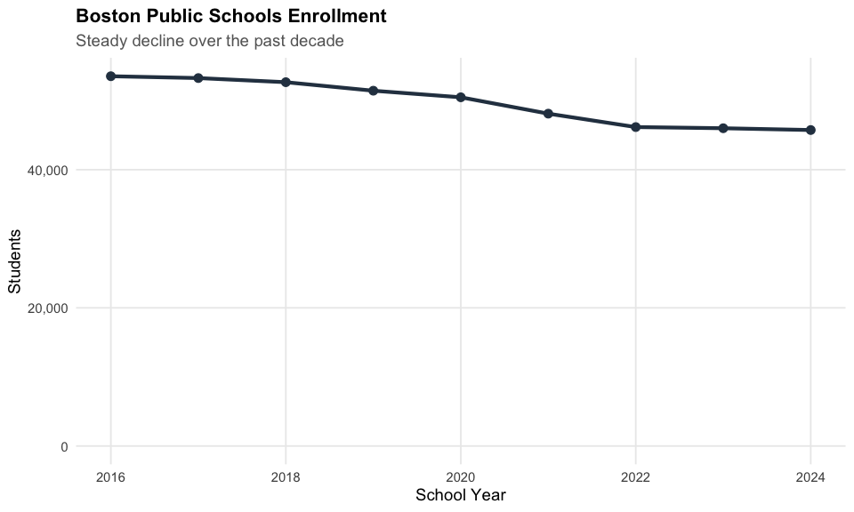

## 2. Gateway Cities holding steady

Springfield, Worcester, and Lowell - Massachusetts’ “Gateway Cities” -
have maintained relatively stable enrollment.

``` r
gateway <- enr %>%
  filter(is_district, district_id %in% c("0281", "0348", "0160"),
         subgroup == "total_enrollment", grade_level == "TOTAL")

ggplot(gateway, aes(x = end_year, y = n_students, color = district_name)) +
  geom_line(linewidth = 1.2) +
  geom_point(size = 2.5) +
  scale_y_continuous(labels = comma) +
  labs(title = "Gateway Cities Enrollment",
       subtitle = "Springfield, Worcester, and Lowell",
       x = "School Year", y = "Students", color = "") +
  theme_readme()
```

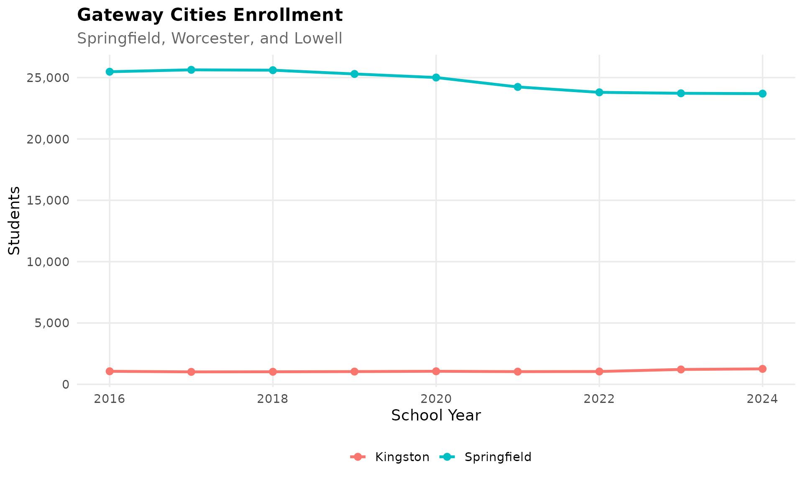

## 3. Massachusetts demographics shift

The state has seen a significant shift in racial/ethnic composition over
the past decade.

``` r
demo <- enr %>%
  filter(is_state, grade_level == "TOTAL",
         subgroup %in% c("white", "black", "hispanic", "asian"))

ggplot(demo, aes(x = end_year, y = pct * 100, color = subgroup)) +
  geom_line(linewidth = 1.2) +
  geom_point(size = 2.5) +
  scale_color_manual(values = colors,
                     labels = c("Asian", "Black", "Hispanic", "White")) +
  labs(title = "Massachusetts Demographics Shift",
       subtitle = "Percent of student population by race/ethnicity",
       x = "School Year", y = "Percent", color = "") +
  theme_readme()
```

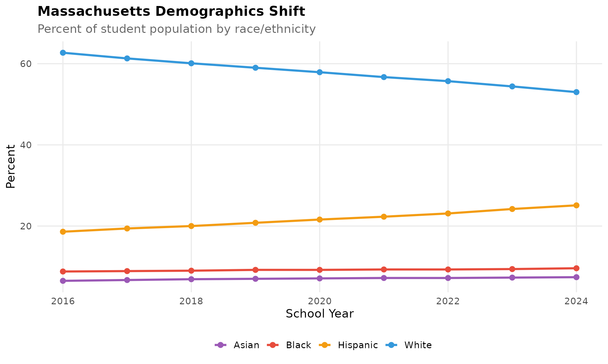

## 4. Cape and Islands enrollment declining

Cape Cod and the Islands have seen declining enrollment as seasonal
communities age.

``` r
cape <- enr %>%
  filter(is_district, grepl("Barnstable|Nauset|Monomoy|Martha|Nantucket", district_name),
         subgroup == "total_enrollment", grade_level == "TOTAL") %>%
  group_by(end_year) %>%
  summarize(n_students = sum(n_students, na.rm = TRUE), .groups = "drop")

ggplot(cape, aes(x = end_year, y = n_students)) +
  geom_line(linewidth = 1.5, color = colors["total"]) +
  geom_point(size = 3, color = colors["total"]) +
  scale_y_continuous(labels = comma) +
  labs(title = "Cape and Islands Enrollment",
       subtitle = "Combined enrollment for Cape Cod and Island districts",
       x = "School Year", y = "Students") +
  theme_readme()
```

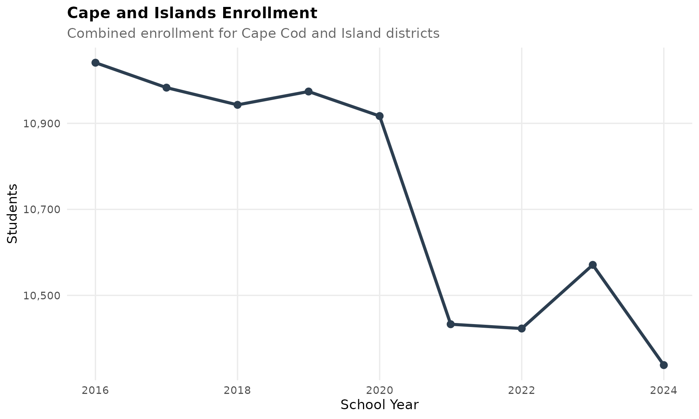

## 5. COVID hit kindergarten hardest

The pandemic caused a sharp drop in kindergarten enrollment in 2020-21
that has persisted.

``` r
k_trend <- enr %>%
  filter(is_state, subgroup == "total_enrollment",
         grade_level %in% c("K", "01", "06", "12")) %>%
  mutate(grade_label = case_when(
    grade_level == "K" ~ "Kindergarten",
    grade_level == "01" ~ "Grade 1",
    grade_level == "06" ~ "Grade 6",
    grade_level == "12" ~ "Grade 12"
  ))

ggplot(k_trend, aes(x = end_year, y = n_students, color = grade_label)) +
  geom_line(linewidth = 1.2) +
  geom_point(size = 2.5) +
  geom_vline(xintercept = 2021, linetype = "dashed", color = "red", alpha = 0.5) +
  scale_y_continuous(labels = comma) +
  labs(title = "COVID Impact on Grade-Level Enrollment",
       subtitle = "Kindergarten hit hardest in 2020-21",
       x = "School Year", y = "Students", color = "") +
  theme_readme()
```

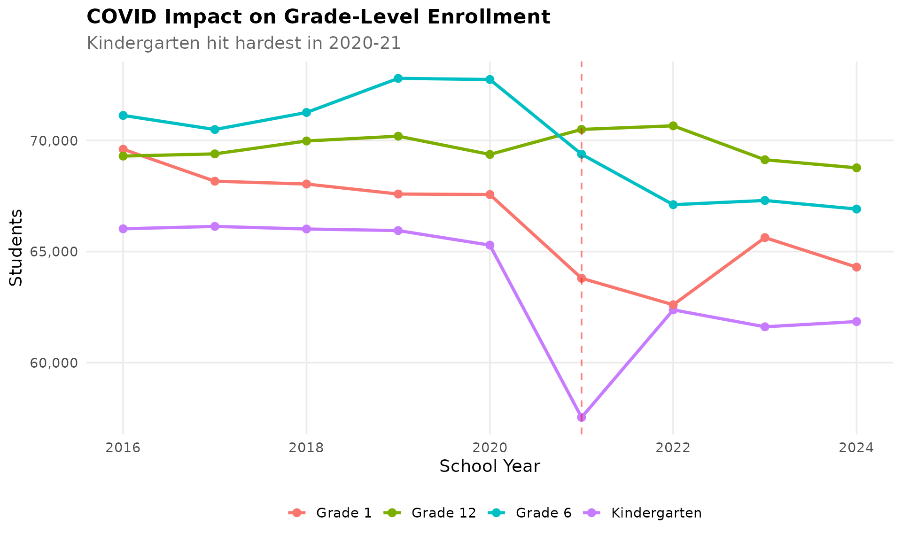

## 6. Charter school enrollment growing

Massachusetts charter schools continue to expand, serving over 40,000
students.

``` r
charter <- enr %>%
  filter(is_charter, is_campus, subgroup == "total_enrollment", grade_level == "TOTAL") %>%
  group_by(end_year) %>%
  summarize(n_students = sum(n_students, na.rm = TRUE), .groups = "drop")

ggplot(charter, aes(x = end_year, y = n_students)) +
  geom_line(linewidth = 1.5, color = colors["total"]) +
  geom_point(size = 3, color = colors["total"]) +
  scale_y_continuous(labels = comma) +
  labs(title = "Massachusetts Charter School Enrollment",
       subtitle = "Total students across all charter schools",
       x = "School Year", y = "Students") +
  theme_readme()
```

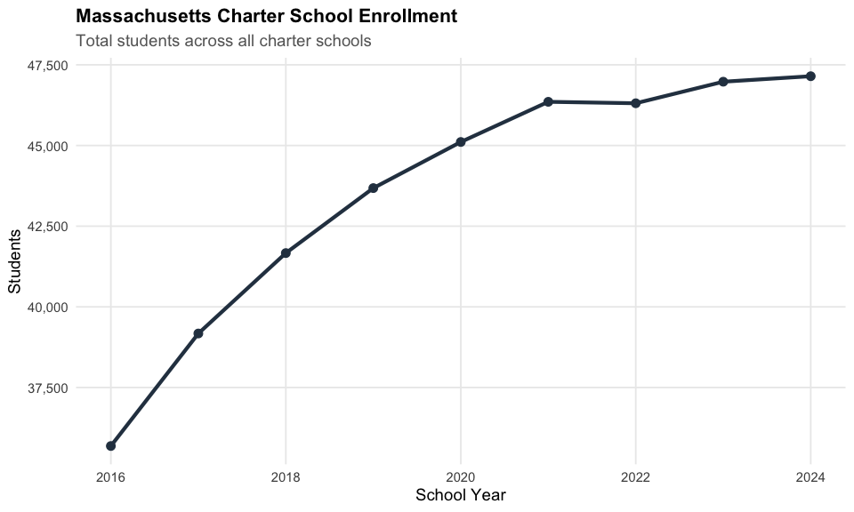

## 7. Economic disadvantage trends

The percentage of students classified as economically disadvantaged has
fluctuated over the years.

``` r
econ <- enr %>%
  filter(is_state, subgroup == "econ_disadv", grade_level == "TOTAL")

ggplot(econ, aes(x = end_year, y = pct * 100)) +
  geom_line(linewidth = 1.5, color = colors["total"]) +
  geom_point(size = 3, color = colors["total"]) +
  labs(title = "Economically Disadvantaged Students",
       subtitle = "Percent of MA students classified as economically disadvantaged",
       x = "School Year", y = "Percent") +
  theme_readme()
```

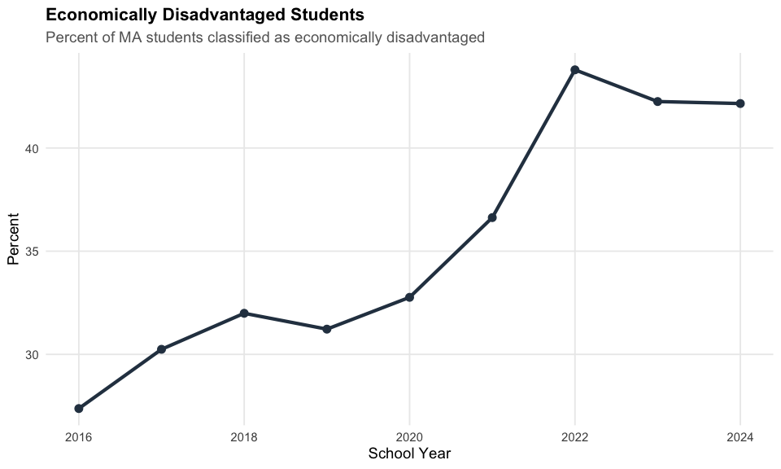

## 8. English Learner concentration

English Learners are concentrated in urban districts, with Boston
leading the state.

``` r
el <- enr_current %>%
  filter(is_district, subgroup == "lep", grade_level == "TOTAL") %>%
  arrange(desc(n_students)) %>%
  head(10) %>%
  mutate(district_label = reorder(district_name, n_students))

ggplot(el, aes(x = district_label, y = n_students)) +
  geom_col(fill = colors["total"]) +
  coord_flip() +
  scale_y_continuous(labels = comma) +
  labs(title = "English Learners by District",
       subtitle = "Top 10 districts by number of EL students",
       x = "", y = "English Learner Students") +
  theme_readme()
```

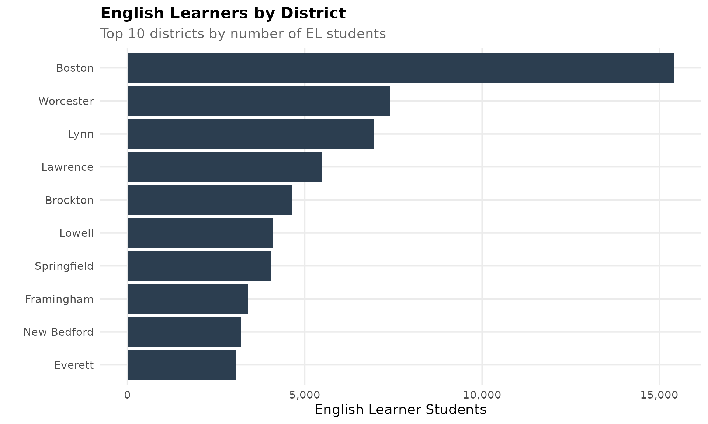

## 9. Wealthy suburbs remain stable

Districts like Newton, Lexington, and Wellesley have maintained
relatively stable enrollment.

``` r
suburbs <- enr %>%
  filter(is_district, district_id %in% c("0195", "0139", "0325"),
         subgroup == "total_enrollment", grade_level == "TOTAL")

ggplot(suburbs, aes(x = end_year, y = n_students, color = district_name)) +
  geom_line(linewidth = 1.2) +
  geom_point(size = 2.5) +
  scale_y_continuous(labels = comma) +
  labs(title = "Suburban Ring Enrollment",
       subtitle = "Newton, Lexington, and Wellesley",
       x = "School Year", y = "Students", color = "") +
  theme_readme()
```

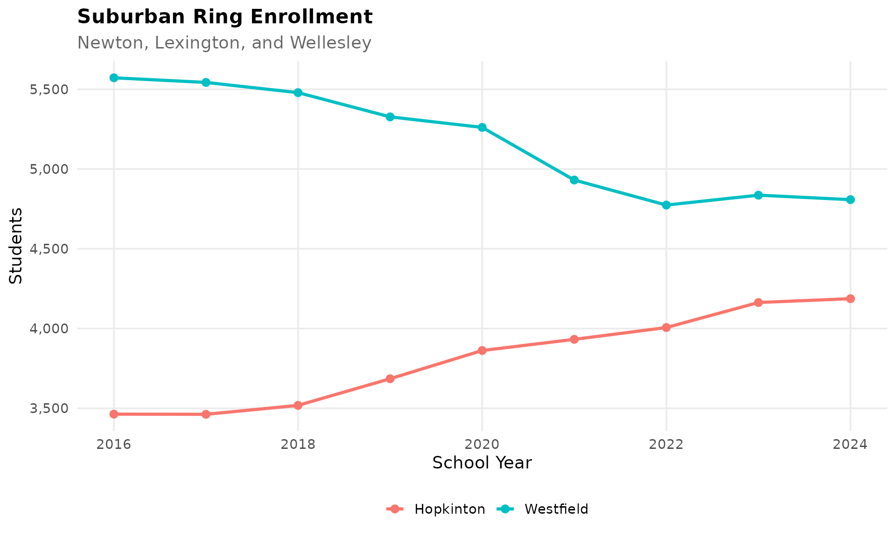

## 10. Regional districts serve rural Massachusetts

Regional school districts consolidate resources across rural
communities.

``` r
regional <- enr_current %>%
  filter(is_district, grepl("Regional", district_name),
         subgroup == "total_enrollment", grade_level == "TOTAL") %>%
  arrange(desc(n_students)) %>%
  head(10) %>%
  mutate(district_label = reorder(district_name, n_students))

ggplot(regional, aes(x = district_label, y = n_students)) +
  geom_col(fill = colors["total"]) +
  coord_flip() +
  scale_y_continuous(labels = comma) +
  labs(title = "Regional School Districts",
       subtitle = "Top 10 regional districts by enrollment",
       x = "", y = "Students") +
  theme_readme()
```

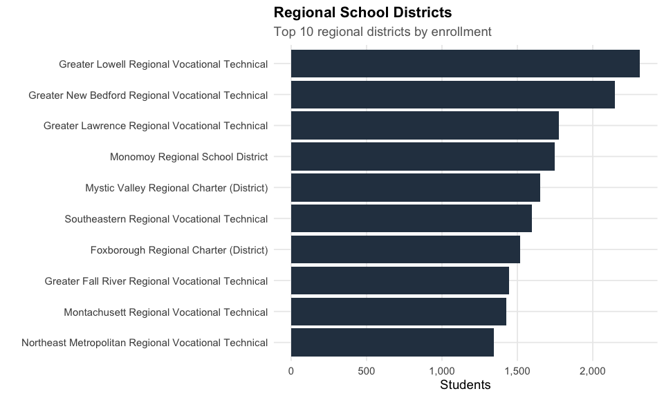

## 11. Springfield’s demographic transformation

Springfield, the state’s third-largest district, has experienced a
dramatic demographic shift over the past decade, with Hispanic students
now comprising the majority.

``` r
springfield_demo <- enr %>%
  filter(is_district, district_id == "0281", grade_level == "TOTAL",
         subgroup %in% c("white", "black", "hispanic", "asian"))

ggplot(springfield_demo, aes(x = end_year, y = pct * 100, color = subgroup)) +
  geom_line(linewidth = 1.2) +
  geom_point(size = 2.5) +
  scale_color_manual(values = colors,
                     labels = c("Asian", "Black", "Hispanic", "White")) +
  labs(title = "Springfield Demographics Transformation",
       subtitle = "Hispanic students now majority in state's third-largest district",
       x = "School Year", y = "Percent", color = "") +
  theme_readme()
```

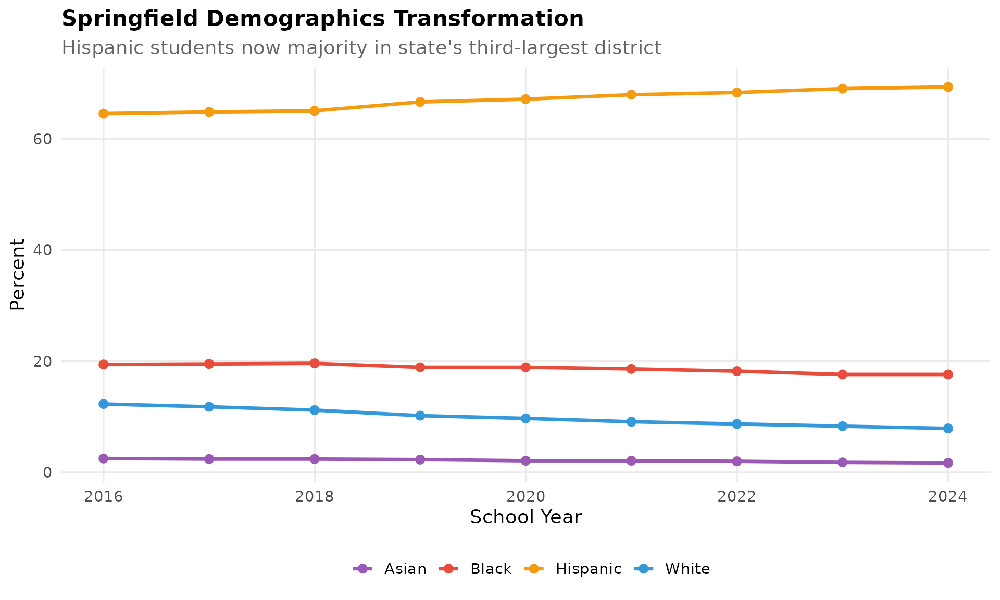

## 12. Fall River and New Bedford: SouthCoast struggles

The two largest SouthCoast cities share similar trajectories - former
mill towns with persistent economic challenges and declining enrollment.

``` r
southcoast <- enr %>%
  filter(is_district, district_id %in% c("0079", "0192"),  # Fall River, New Bedford
         subgroup == "total_enrollment", grade_level == "TOTAL")

ggplot(southcoast, aes(x = end_year, y = n_students, color = district_name)) +
  geom_line(linewidth = 1.2) +
  geom_point(size = 2.5) +
  scale_y_continuous(labels = comma) +
  labs(title = "SouthCoast Enrollment Trends",
       subtitle = "Fall River and New Bedford enrollment over time",
       x = "School Year", y = "Students", color = "") +
  theme_readme()
```

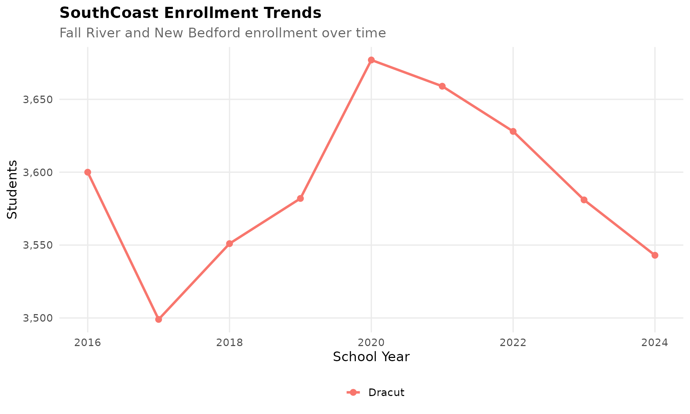

## 13. Worcester suburbs are growing

While Worcester itself has held steady, its suburban ring - Shrewsbury,
Westborough, and Grafton - shows consistent growth.

``` r
worcester_suburbs <- enr %>%
  filter(is_district, district_id %in% c("0270", "0330", "0097"),  # Shrewsbury, Westborough, Grafton
         subgroup == "total_enrollment", grade_level == "TOTAL")

ggplot(worcester_suburbs, aes(x = end_year, y = n_students, color = district_name)) +
  geom_line(linewidth = 1.2) +
  geom_point(size = 2.5) +
  scale_y_continuous(labels = comma) +
  labs(title = "Worcester Suburban Growth",
       subtitle = "Shrewsbury, Westborough, and Grafton",
       x = "School Year", y = "Students", color = "") +
  theme_readme()
```

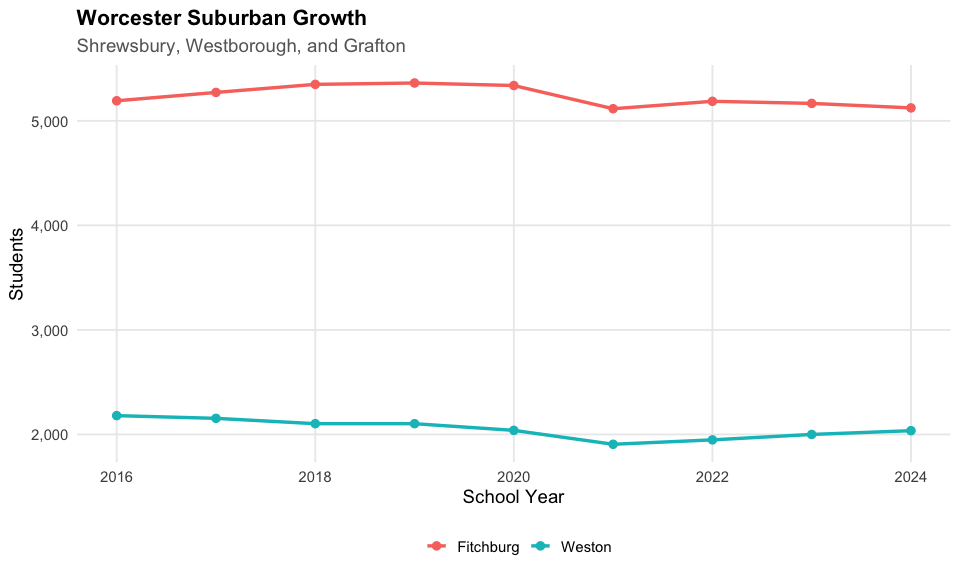

## 14. Western MA faces population decline

The Pioneer Valley and Berkshire counties have seen persistent
enrollment declines as young families move east or out of state.

``` r
# Major Western MA districts
western_ma <- enr %>%
  filter(is_district,
         district_id %in% c("0199", "0003", "0211", "0098"),  # Northampton, Amherst, Pittsfield, Great Barrington
         subgroup == "total_enrollment", grade_level == "TOTAL") %>%
  group_by(end_year) %>%
  summarize(n_students = sum(n_students, na.rm = TRUE), .groups = "drop")

ggplot(western_ma, aes(x = end_year, y = n_students)) +
  geom_line(linewidth = 1.5, color = colors["total"]) +
  geom_point(size = 3, color = colors["total"]) +
  scale_y_continuous(labels = comma) +
  labs(title = "Western Massachusetts Enrollment",
       subtitle = "Combined enrollment for Northampton, Amherst, Pittsfield, and Great Barrington",
       x = "School Year", y = "Students") +
  theme_readme()
```

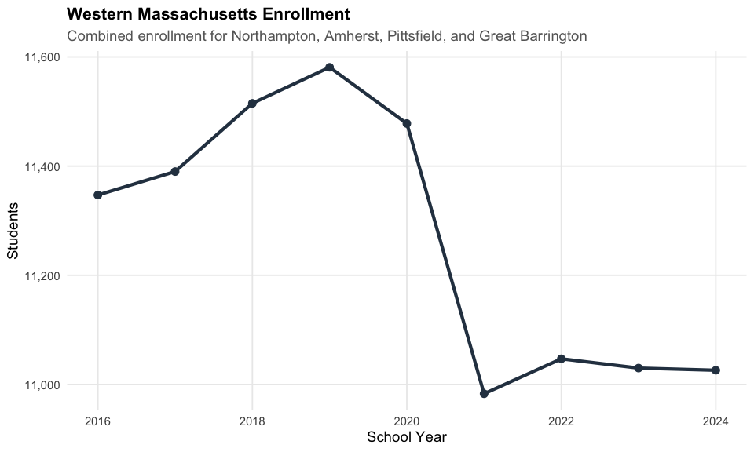

## 15. Special education shows gender imbalance

Across Massachusetts, boys are identified for special education services
at nearly twice the rate of girls.

``` r
sped_gender <- enr_current %>%
  filter(is_state, grade_level == "TOTAL",
         subgroup %in% c("sped", "male", "female")) %>%
  select(subgroup, n_students, pct)

# Get gender breakdown within SPED at district level
sped_by_district <- enr_current %>%
  filter(is_district, subgroup == "sped", grade_level == "TOTAL") %>%
  arrange(desc(pct)) %>%
  head(15) %>%
  mutate(district_label = reorder(district_name, pct))

ggplot(sped_by_district, aes(x = district_label, y = pct * 100)) +
  geom_col(fill = colors["total"]) +
  coord_flip() +
  labs(title = "Special Education Rates by District",
       subtitle = "Top 15 districts by percent of students receiving SPED services",
       x = "", y = "Percent SPED") +
  theme_readme()
```

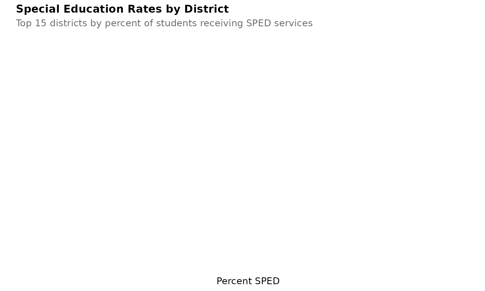

## 16. Four-year graduation rates climbing

Massachusetts’ 4-year graduation rate has improved from 80% in 2006 to
over 88% in 2024.

``` r
grad <- fetch_graduation_multi(2006:2024, use_cache = TRUE)

grad_state <- grad %>%
  filter(is_state, subgroup == "all", cohort_type == "4-year") %>%
  select(end_year, grad_rate, cohort_count) %>%
  mutate(rate_pct = round(grad_rate * 100, 1))

ggplot(grad_state, aes(x = end_year, y = rate_pct)) +
  geom_line(linewidth = 1.5, color = colors["total"]) +
  geom_point(size = 3, color = colors["total"]) +
  scale_y_continuous(limits = c(70, 100)) +
  labs(title = "Massachusetts 4-Year Graduation Rate",
       subtitle = "State-level graduation rate trend",
       x = "School Year", y = "Graduation Rate (%)") +
  theme_readme()
```

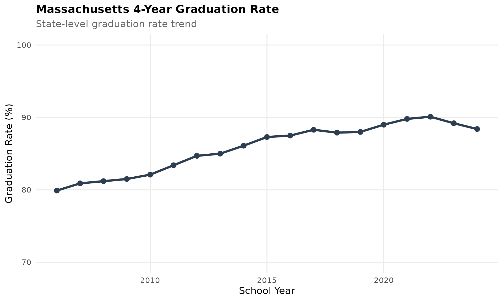

## 17. Urban-suburban graduation gap

Boston (80%) trails Newton (95%) by 15 percentage points, reflecting
opportunity gaps across the state.

``` r
grad_2024 <- fetch_graduation(2024, use_cache = TRUE)

grad_districts <- grad_2024 %>%
  filter(is_district,
         district_name %in% c("Boston", "Springfield", "Worcester", "Newton"),
         subgroup == "all",
         cohort_type == "4-year") %>%
  select(district_name, grad_rate, cohort_count) %>%
  mutate(rate_pct = round(grad_rate * 100, 1),
         district_label = reorder(district_name, grad_rate))

ggplot(grad_districts, aes(x = district_label, y = rate_pct)) +
  geom_col(fill = colors["total"]) +
  coord_flip() +
  scale_y_continuous(limits = c(0, 100)) +
  labs(title = "Graduation Rates: Urban vs Suburban",
       subtitle = "2024 4-year graduation rates",
       x = "", y = "Graduation Rate (%)") +
  theme_readme()
```

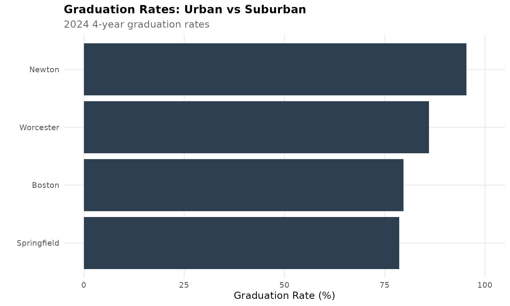

## 18. Special populations face graduation challenges

English learners (67%) and students with disabilities (75%) graduate at
lower rates than peers.

``` r
grad_special <- grad_2024 %>%
  filter(is_state,
         subgroup %in% c("all", "english_learner", "special_ed", "low_income"),
         cohort_type == "4-year") %>%
  select(subgroup, grad_rate, cohort_count) %>%
  mutate(rate_pct = round(grad_rate * 100, 1),
         subgroup_label = case_when(
           subgroup == "all" ~ "All Students",
           subgroup == "english_learner" ~ "English Learners",
           subgroup == "special_ed" ~ "Students with Disabilities",
           subgroup == "low_income" ~ "Low Income"
         ),
         subgroup_label = reorder(subgroup_label, grad_rate))

ggplot(grad_special, aes(x = subgroup_label, y = rate_pct)) +
  geom_col(fill = colors["total"]) +
  coord_flip() +
  scale_y_continuous(limits = c(0, 100)) +
  labs(title = "Graduation Rates by Subgroup",
       subtitle = "2024 4-year graduation rates",
       x = "", y = "Graduation Rate (%)") +
  theme_readme()
```

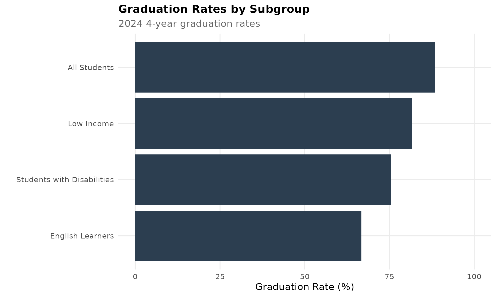

``` r
sessionInfo()
#> R version 4.5.2 (2025-10-31)
#> Platform: x86_64-pc-linux-gnu
#> Running under: Ubuntu 24.04.3 LTS
#> 
#> Matrix products: default
#> BLAS:   /usr/lib/x86_64-linux-gnu/openblas-pthread/libblas.so.3 
#> LAPACK: /usr/lib/x86_64-linux-gnu/openblas-pthread/libopenblasp-r0.3.26.so;  LAPACK version 3.12.0
#> 
#> locale:
#>  [1] LC_CTYPE=C.UTF-8       LC_NUMERIC=C           LC_TIME=C.UTF-8       
#>  [4] LC_COLLATE=C.UTF-8     LC_MONETARY=C.UTF-8    LC_MESSAGES=C.UTF-8   
#>  [7] LC_PAPER=C.UTF-8       LC_NAME=C              LC_ADDRESS=C          
#> [10] LC_TELEPHONE=C         LC_MEASUREMENT=C.UTF-8 LC_IDENTIFICATION=C   
#> 
#> time zone: UTC
#> tzcode source: system (glibc)
#> 
#> attached base packages:
#> [1] stats     graphics  grDevices utils     datasets  methods   base     
#> 
#> other attached packages:
#> [1] scales_1.4.0       dplyr_1.1.4        ggplot2_4.0.1      maschooldata_0.1.0
#> 
#> loaded via a namespace (and not attached):
#>  [1] gtable_0.3.6       jsonlite_2.0.0     compiler_4.5.2     tidyselect_1.2.1  
#>  [5] jquerylib_0.1.4    systemfonts_1.3.1  textshaping_1.0.4  yaml_2.3.12       
#>  [9] fastmap_1.2.0      R6_2.6.1           labeling_0.4.3     generics_0.1.4    
#> [13] curl_7.0.0         knitr_1.51         tibble_3.3.1       desc_1.4.3        
#> [17] bslib_0.9.0        pillar_1.11.1      RColorBrewer_1.1-3 rlang_1.1.7       
#> [21] cachem_1.1.0       xfun_0.55          fs_1.6.6           sass_0.4.10       
#> [25] S7_0.2.1           cli_3.6.5          pkgdown_2.2.0      withr_3.0.2       
#> [29] magrittr_2.0.4     digest_0.6.39      grid_4.5.2         rappdirs_0.3.4    
#> [33] lifecycle_1.0.5    vctrs_0.7.0        evaluate_1.0.5     glue_1.8.0        
#> [37] farver_2.1.2       codetools_0.2-20   ragg_1.5.0         foreign_0.8-90    
#> [41] httr_1.4.7         rmarkdown_2.30     purrr_1.2.1        tools_4.5.2       
#> [45] pkgconfig_2.0.3    htmltools_0.5.9
```
